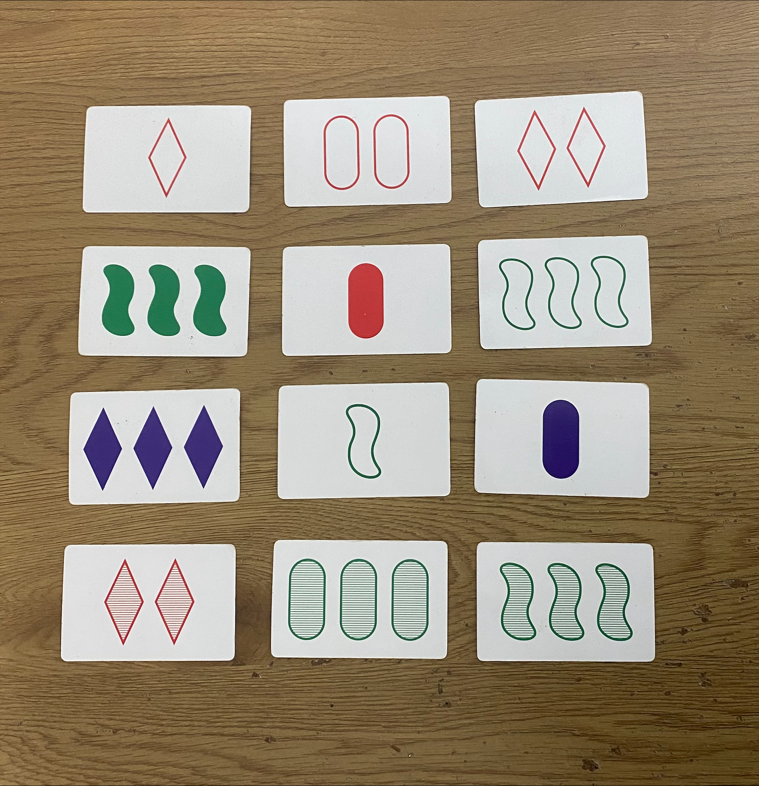
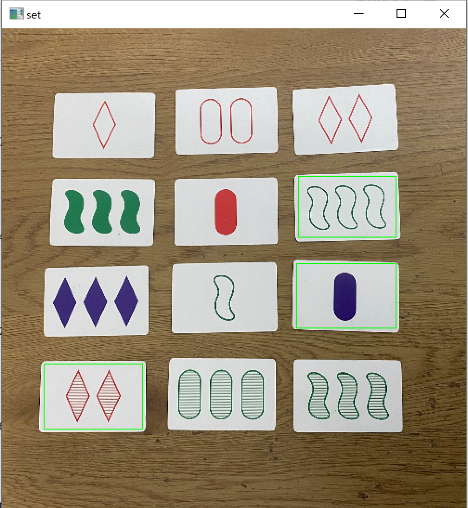

# Set Game Detector

This project uses **OpenCV** to detect a winning set in the **Set game**, a card game involving pattern recognition. The system processes images of cards to identify colors, shapes, and patterns, and determines if a valid "Set" exists among the cards.

## Features
- **Number of Objects Detection**: Detects the number of items,using contours.
- **Shape Detection**: Implements contour detection and other preprocessing techniques to accurately identify shapes on the cards.
- **Color Detection**: Uses HSV color ranges to detect specific card colors (blue, green, red).
- **Coloring Type Detection**: Detects the type of the coloring (solid, empty, half-colored) using both contour and color detection tools.

## Project Structure
- `main.cpp`: The entry point of the project where the main logic is implemented.
- `helper.cpp`: Contains detection functions that detect the four features (number of items, shape, color, filling).
- `Set.cpp`: Implements the core logic for managing the cards and determining if a valid Set exists. This includes creating a container of cards using the detection results, checking combinations, and finding a Winning Set.

## Usage
1. Provide an image of the cards as input.
2. The program will process the image and output whether a winning Set exists, along with visual annotations.

## Contributing
Contributions are welcome! Feel free to open issues or submit pull requests to enhance the project.

Feel free to reach out with questions or suggestions to improve the project. Enjoy playing Set!

## Demo

### Example Input
Below is an example input image:

### Example Output
After processing, the program detects the following Set and annotates the image:

